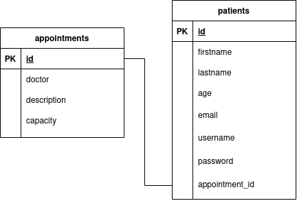

# COMPFEST-Hospital
Hospital Information System - Software Engineering Academy COMPFEST Selection Task 2021

## Backend

Go, PostgreSQL

note:
- admin panel credentials are `admin:compfesthospitaladmin`

## Frontend

[Medilab Bootstrap 5 template from BootstrapMade](https://bootstrapmade.com/medilab-free-medical-bootstrap-theme/download/), modified to meet requirements

### Sketch

Sitemap / functionalities / features

DB

### Notes for COMPFEST

- Requirement “List of registrant” dalam “Doctor appointment” tidak spesifik terhadap data registrant apa saja yang ditampilkan, dianggap hanya data pribadi: first name, last name, age, email (di /administration).
- Requirement “Patients can see a list of appointments” kurang spesifik mengenai data appointment apa yang dapat dilihat, dianggap data yang tidak menyangkut pasien lain: doctor name, appointment description, total registrant, total appointment capacity (di /appointments).
- Requirement “fully booked registrant” tidak jelas spesifikasinya, dianggap setiap doctor appointment saat di create oleh admin akan ada maksimum registrant untuk masing-masing appointment (di /administration dan /appointments).

### Planned

- change "patients" table into "users" table with an additional "role" field
  - this adds the abilty to manually add more admin role accounts
- more specific text field types in "patients" table

#### Requirements

- [ ] authentication
  - [x] jwt

- [ ] acc roles
  - [x] admin
    - [x] default superuser acc
  - [ ] patient
    - [x] /register
    - [x] /login
    - [ ] /user/username
    - [x] /logout

- [ ] admin funcs
  - [ ] doctor appointment
    - [ ] c
    - [x] r
      - [x] r registrants per appointment
    - [ ] u
    - [ ] d

- [ ] patient funcs
  - [ ] see list of appointments (all?)
  - [ ] apply for appointment
    - [ ] check if fully booked registrant (how many?)
  - [ ] cancel an appointment

##### timeline

july 5
- start proj
- sketch sitemap / functionalities
- object definitions
- in memory db
- frontend
- register

july 6
- logout
- login
- jwt
- sketch + implement postgres db
- admin read

july 7
- admin create
- 

###### References

[Implementing JWT based authentication in Golang](https://www.sohamkamani.com/golang/jwt-authentication/)

###### Footnotes

I genuinely really enjoy making this webapp, using minimal frameworks, with a new language I just learned, facing all it's challenges.
I hope to learn more of this in the academy, I really want to be able to do more of this, and to make it my job, and learn even more in the field!
