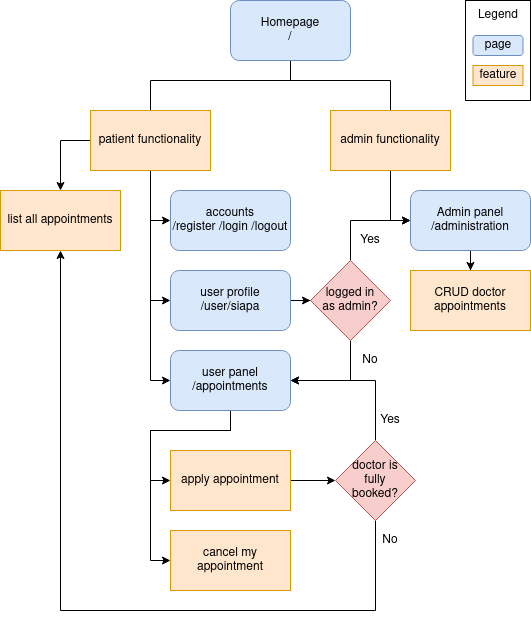
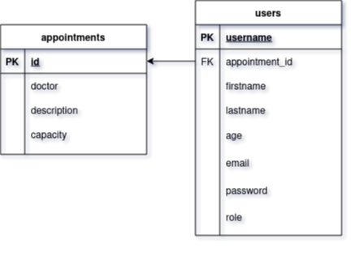

# COMPFEST-Hospital
Hospital Information System - Software Engineering Academy COMPFEST Selection Task 2021

## Backend

Go, PostgreSQL

note:
- admin panel credentials are `admin:compfesthospitaladmin`

## Frontend

Go ([html/template](https://pkg.go.dev/html/template))

[Medilab Bootstrap 5 template from BootstrapMade](https://bootstrapmade.com/medilab-free-medical-bootstrap-theme/download/), modified to meet requirements

### Sketch

Sitemap / functionalities / features

DB

### Notes for COMPFEST

- Requirement “List of registrant” dalam “Doctor appointment” tidak spesifik terhadap data registrant apa saja yang ditampilkan, dianggap hanya data pribadi: first name, last name, age, email (di /administration).
- Requirement “Patients can see a list of appointments” kurang spesifik mengenai data appointment apa yang dapat dilihat, dianggap data yang tidak menyangkut pasien lain: doctor name, appointment description, total registrant, total appointment capacity (di /appointments).
- Requirement “fully booked registrant” tidak jelas spesifikasinya, dianggap setiap doctor appointment saat di create oleh admin akan ada maksimum registrant untuk masing-masing appointment (di /administration dan /appointments).

#### Requirements

- [x] authentication
  - [x] jwt

- [ ] acc roles
  - [x] admin
    - [x] default superuser acc
  - [ ] patient
    - [x] /register
    - [x] /login
    - [ ] /user/username
    - [x] /logout

- [x] admin funcs
  - [x] doctor appointment crud
    - [x] c
    - [x] r
      - [x] r registrants per appointment
    - [x] u
    - [x] d

- [x] patient funcs
  - [x] see list of appointments (all?)
  - [x] apply for appointment
    - [x] check if fully booked registrant (how many?)
  - [x] cancel an appointment

##### timeline

july 5
- start proj
- sketch sitemap / functionalities
- object definitions
- in memory db
- frontend
- register

july 6
- logout
- login
- jwt
- sketch + implement postgres db
- admin frontend + read

july 7
- admin create, update, delete
- patient read, cancel, apply
- update db schema

july 8
- user profile crud (not a req but why not)
- toasts
- heroku

##### Original Requirements

1. ~~Authentication~~
   - ~~There are two types of account roles: **Administrator** and **Patient**.~~ determined by "admin" field in "users" table
   - ~~Users are only allowed to create account of role **Patient**. (create a super user account by default to act as an admin).~~
   - ~~Implement the usage of JWT in your authentication.~~
   - ~~An account must hold this information:~~
     - ~~First Name~~
     - ~~Last Name~~
     - ~~Age~~
     - ~~Email~~
     - ~~Username~~
     - ~~Password~~
1. ~~Administrator Requirements~~ admin crud on "appointments" table in `/administration` page
   - ~~Administrator can create a new doctor appointment.~~
   - ~~Doctor appointment must have this information:~~
     - ~~Doctor Name~~
     - ~~Appointment Description~~
     - ~~List of registrant~~ we use aggregate func
   - ~~Administrator can update doctor appointments.~~
   - ~~Administrator can delete doctor appointments.~~
   - ~~Administrator can see a list of patients that are registered in each appointment.~~ only see, nothing more ;)
1. ~~Patient Requirements~~ patient `/appointments` page
   - ~~Patients can see a list of appointments.~~
   - ~~Patients can apply for an appointment.~~ "an" means one, so only 1 appointment per patient
   - ~~Patients can cancel their appointment.~~
   - ~~Patients cannot apply for an appointment with a fully booked registrant.~~
- When you are finished with your website, you should deploy it into cloud services, such as Heroku, Netlify, etc.
- Make sure you've created a good README in your repository about your project.
- ~~Also make sure that your repository is public.~~

###### Todo

- ~~change "patients" table into "users" table with an additional "role" field~~
  - ~~this adds the abilty to manually add more admin role accounts~~
- ~~change "patient" primary key to "username" instead of unnecessary field "id"~~
- more specific text field types in "patients" table

###### References

[Implementing JWT based authentication in Golang](https://www.sohamkamani.com/golang/jwt-authentication/)

[Getting Started on Heroku with Go - Use a database](https://devcenter.heroku.com/articles/getting-started-with-go#use-a-database)

###### Footnotes

I genuinely really enjoy making this webapp, using minimal frameworks, with a new language I just learned, facing all it's challenges.
I hope to learn more of this in the academy, I really want to be able to do more of this, and to make it my job, and learn even more in the field!
