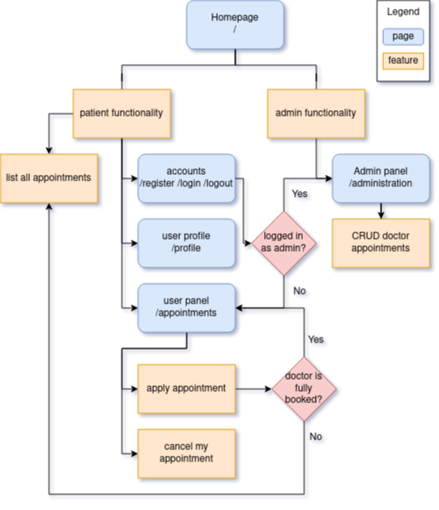

# COMPFEST-Hospital
Hospital Information System - Software Engineering Academy COMPFEST Selection Task 2021

## Backend

Go, PostgreSQL, Heroku ([compfesthospital.herokuapp.com](https://compfesthospital.herokuapp.com/))

notes:
- default admin credentials are username:`admin` password:`compfesthospitaladmin`
- sample patient credential username:`aboots` password:`andi`

## Frontend

Go ([html/template](https://pkg.go.dev/html/template))

[Medilab Bootstrap 5 template from BootstrapMade](https://bootstrapmade.com/medilab-free-medical-bootstrap-theme/download/), modified to meet requirements

### Sketch

made with [draw.io](https://app.diagrams.net/)

Sitemap / functionalities / features

DB

No sessions table since we use JWT

### Notes for COMPFEST

- Requirement “List of registrant” dalam “Doctor appointment” tidak spesifik terhadap data registrant apa saja yang ditampilkan, dianggap hanya data pribadi: first name, last name, age, email (di [/administration](https://compfesthospital.herokuapp.com/administration)).

- Requirement “Patients can see a list of appointments” kurang spesifik mengenai data appointment apa yang dapat dilihat, dianggap data yang tidak menyangkut pasien lain: doctor name, appointment description, total registrant, total appointment capacity (di [/appointments](https://compfesthospital.herokuapp.com/appointments)).

- Requirement “fully booked registrant” tidak jelas spesifikasinya, dianggap setiap doctor appointment saat di create oleh admin akan ada maksimum registrant untuk masing-masing appointment (di [/administration](https://compfesthospital.herokuapp.com/administration) dan [/appointments](https://compfesthospital.herokuapp.com/appointments)).

- Nama file ada yang diberi angka seperti `00-constants.go` untuk mengontrol compilation order

#### Requirements -> Implementations / Notes

1. Authentication
   - There are two types of account roles: **Administrator** and **Patient**. -> determined by "admin" field in "users" table
   - Users are only allowed to create account of role **Patient**. (create a super user account by default to act as an admin). -> "admin" field is false by default
   - Implement the usage of JWT in your authentication. -> stores username and session expiry time
   - An account must hold this information: -> "users" table
     - First Name
     - Last Name
     - Age
     - Email
     - Username
     - Password
1. Administrator Requirements -> admin crud on "appointments" table in `/administration` page
   - Administrator can create a new doctor appointment.
   - Doctor appointment must have this information: -> "appointments" table
     - Doctor Name
     - Appointment Description
     - List of registrant -> use aggregate func
   - Administrator can update doctor appointments.
   - Administrator can delete doctor appointments.
   - Administrator can see a list of patients that are registered in each appointment. -> only see, so admins cannot kick patients off appointments
2. Patient Requirements -> patient `/appointments` page
   - Patients can see a list of appointments. -> only doctor name, description, and total registrants, not data of other registrants
   - Patients can apply for an appointment. -> "an" means one, so only 1 appointment per patient, implemented as field "appointment_id" in "users" table
   - Patients can cancel their appointment. -> set "appointment_id" field as null
   - Patients cannot apply for an appointment with a fully booked registrant. -> use aggregate func
- When you are finished with your website, you should deploy it into cloud services, such as Heroku, Netlify, etc. -> https://compfesthospital.herokuapp.com/
- Make sure you've created a good README in your repository about your project. -> hopefully this is good enough
- Also make sure that your repository is public. -> yep

###### References

[Implementing JWT based authentication in Golang](https://www.sohamkamani.com/golang/jwt-authentication/)

[Getting Started on Heroku with Go](https://devcenter.heroku.com/articles/getting-started-with-go)

[Bootstrap 4.3 docs](https://getbootstrap.com/docs/4.3/getting-started/introduction/)

[Go docs](https://pkg.go.dev/)

###### Footnotes

I genuinely really enjoy making this webapp, using minimal frameworks, with a new language I just learned, facing all it's challenges.
I hope to learn more of this in the academy, I really want to be able to do more of this, and to make it my job, and learn even more in the field!
