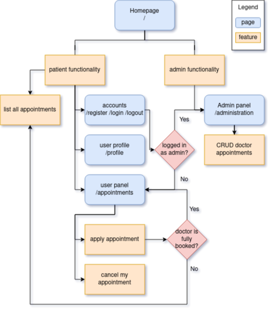
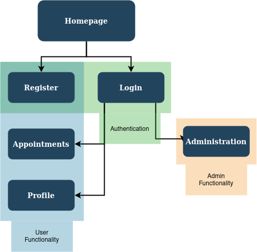
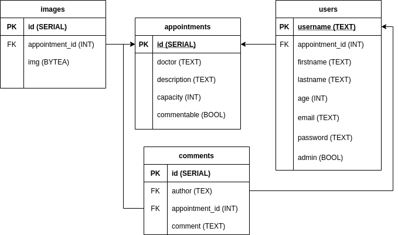

# Website specification
___

Original requirements from client is available in [requirements.pdf](requirements.pdf), an annotated version made by the dev is available in [requirements-annotated.pdf](requirements-annotated.pdf)

Technologies used in the web app is specified in this repo's [README.md](../README.md)

Table of Contents
- [Website specification](#website-specification)
  - [Design](#design)
    - [Site map](#site-map)
      - [Features](#features)
    - [Content types](#content-types)
      - [Content type data](#content-type-data)
    - [UI / Frontend](#ui--frontend)
      - [Accessibility](#accessibility)
  - [Functionality](#functionality)
    - [Hosting](#hosting)
  - [Assumptions](#assumptions)
  - [References](#references)

## Design

The first step we took in developing this web app was designing various aspects of the website, a mockup / sketch flowchat was made with the focus on the flow of the user experience:

### Site map

#### Features

Each page houses one or a set of functionalities:
- Template / Base \
  The template / base is a layout that houses each page, thus all the features of this layout will be available in all pages according to some conditions
  - Navigation bar \
    Depending on user type (admin or patient), the navbar show different links
  - Account functionalities, for both admin and patient
    - Register (patient only)
    - Login
    - Logout
    - Profile features (patient only)
- Homepage \
  Intro to the web app, the functionalities and usage
- Appointments \
  List of doctor appointments
  - Admins have CRUD privileges
  - Patients can apply to 1 appointment, and can cancel their appointment
- Administration \
  For admin CRUD functionality on appointments
- Profile \
  For users to read and update or delete their profile
- Register \
  Patients only, admins can be registered by manually inserting an entry into the database
- Login \
  For both admin and patients

Each page also has access control mechanisms in place that verify users based on their session in their JWT cookie, and the "users" table in the database

### Content types

Current content types to satisfy requirements are

- Patients (concrete)
- Appointments (concrete)
- Doctors (abstract)
- Administrators (concrete)

#### Content type data

The content types are detailed

- Patients
  - First name
  - Last name
  - Age
  - Email
  - Username
  - Password
- Appointments
  - Doctor's name
  - Description
  - List of patients registered
- Doctors
  - Full name
- Administrators
  - Username
  - Password
  - Privileges

These data are then assigned types and based on the nature (concrete or abstract), transformed into a database with the following schema

This schema corresponds to the requirements as specified in [requirements-annotated.pdf](requirements-annotated.pdf)

### UI / Frontend

Frankly the dev isn't good at frontend, but can work with HTML, CSS, and JS. So a plan is needed to circumvent this weakness.

We used a preexisting template with a medical theme, and then disassembled it. The disassembled parts are then modified, repurposed, and used to build custom UI elements that can satisfy our client's requirements, the exact steps we took:

1. Find a medical static page template, [Medilab by BootstrapMade](https://bootstrapmade.com/medilab-free-medical-bootstrap-theme/download/)
2. Break it into components, sections, and pages/layouts
3. Identify and modify parts that are usable for our requirements, and turn them into workable templates
4. Add more components, sections, and pages using [Bootstrap](https://getbootstrap.com/docs/4.3/getting-started/introduction/) framework until all the requirements are satisfied
5. Combine the parts into pages that make up our webapp.

We used Go's `html/template` library to perform the templating and layouting.

#### Accessibility

Thanks to our template and sufficient CSS skills, we're able to make the entire webapp mobile friendly.

## Functionality

As discussed in the [Features](#features) section, each page in the sitemap hosts a certain number of features, corresponding to the [requirements-annotated.pdf](requirements-annotated.pdf) document, the implementations are as follows:

1. Authentication
   - Method of authentication \
     User accounts system with JWT in browser cookies for session mechanism, operations include `/login` and `/logout`
   - Register \
     Creates an entry in the "users" table with "admin" set to false
   - Login \
     Compares entered credentials with the ones in the database and gives them a session with the appropriate role, the session is stored in the JWT containing the user's username and session expiry time
   - Logout \
     Destroys the user's JWT cookie
2. Administrator
   - The admin panel on `/administration` provides CRUD operations for the "appointments" table:
     - Create a new doctor appointment
     - Read existing appointments and the patients registered to each one
     - Update appointment details
     - Delete appointments, also unregisters patients that already registered to it
3. Patient
   - The appointments panel on `/appointments` provides operation that modify each patient's field in the "users" table that references an appointment:
     - Patients applying to an appointment will assign that appointment'd unique identifier to the patient's record in the "users" table
     - Patients cancelling an appointment will assign a null value on the patient's appointment field

### Hosting

As directed by the requirements, we used heroku to host our webapp and our postgresql database, live at https://compfesthospital.herokuapp.com

## Assumptions

Some unclear requirements are given, and we made these assumptions to make sure we deliver the end product as best as possible while still being on time.

1. Authentication
   - There are two types of account roles \
     It is not explicitly specified how this is implemented, so we went with a boolean field in the "users" table named "admin"
2. Administrator
   - "List of registrant" \
     Registrant data that will be displayed is not specified, we choose to only display public data; first name, last name, age, email
   - "Administrator can see a list of patients that are registered in each appointment" \
     Reading is the only necessary requirement, no editing
   - Admins have no privileges to edit patient data
3. Patient
   - "Patients can see a list of appointments" \
     Appointment data to be displayed is not specified, we assumed this to be public data; doctor name, description, current registrants count, and max registrants. Also it is stated that only patients can see this list, so users need to be registered as a patient to use this functionality
   - "Patients cannot apply for an appointment with a fully booked registrant" \
     It is not specified the details of what an appointment with a fully booked registrant is, so we decided that each appointment will have it's own maximum registrants count

___

## References

[Implementing JWT based authentication in Golang](https://www.sohamkamani.com/golang/jwt-authentication/)

[Getting Started on Heroku with Go](https://devcenter.heroku.com/articles/getting-started-with-go)

[Bootstrap 4.3 docs](https://getbootstrap.com/docs/4.3/getting-started/introduction/)

[Go docs](https://pkg.go.dev/)

All diagrams made with [draw.io](https://app.diagrams.net/)

[Guide: Writing effective website specification documents](https://highrise.digital/blog/web-specification-guide/#hd-block-9)
